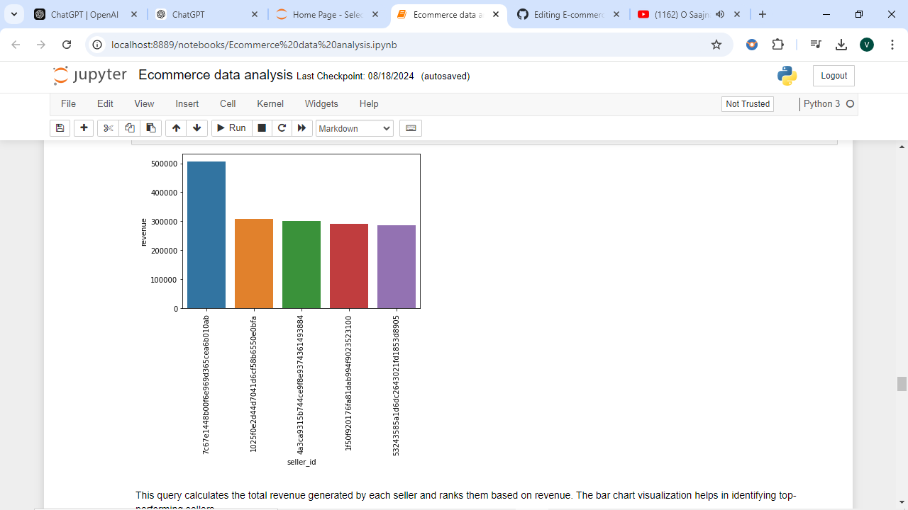

# E-commerce Data Analysis

This project involves analyzing an e-commerce dataset to gain insights into customer behavior, sales trends, and product performance. The dataset consists of multiple CSV files covering various aspects of the e-commerce operations, including customers, orders, sellers, products, payments, and more.

## Project Description

The main objectives of this project are to:

- **Analyze Customer Distribution**: Identify unique cities where customers are located.
- **Order Trends**: Count the number of orders placed in specific years and analyze order trends over time.
- **Sales Analysis**: Determine total sales per product category and the percentage contribution of each category to total revenue.
- **Payment Analysis**: Calculate the percentage of orders paid in installments.
- **Customer Insights**: Analyze the number of customers from each state, average number of products per order by city, and top customers based on spending.
- **Revenue and Sales Insights**: Calculate the total revenue generated by each seller, the moving average of order values, and cumulative sales per month.
- **Customer Retention and Growth**: Calculate the retention rate of customers and the year-over-year growth rate of total sales.

## Dataset

The dataset consists of the following CSV files:

- **customers.csv**: Contains customer details.
- **orders.csv**: Contains order details.
- **sellers.csv**: Contains seller information.
- **products.csv**: Contains product details.
- **geolocation.csv**: Contains geographical data.
- **payments.csv**: Contains payment information.
- **order_items.csv**: Contains details of items in each order.

## Setup and Installation

1. Install the necessary Python packages by running the following command:
   ```bash
   pip install pandas mysql-connector-python matplotlib seaborn
   ```

2. Clone this repository:
   ```bash
   git clone https://github.com/your-username/ecommerce-data-analysis.git
   ```

3. Navigate to the project directory:
   ```bash
   cd ecommerce-data-analysis
   ```

4. Ensure that MySQL server is running and the e-commerce database is created. Update the database connection parameters in the script as needed.

## Usage

1. **Data Import**: The script imports data from CSV files into a MySQL database.
   
2. **Data Analysis**: Various SQL queries are executed to generate insights from the database.
   
3. **Visualizations**: Bar charts are generated to visualize key findings.

## Key Visualizations

### 1. Count of Customers by States
This bar chart shows the number of customers from each state.


### 2. Count of Orders by Months in 2018
This bar chart displays the number of orders per month for the year 2018.


### 3. Total Revenue by Seller
This bar chart ranks sellers by the total revenue generated.



### 4. Top 3 Customers by Spending
This bar chart identifies the top 3 customers who spent the most money each year.


## Code Structure

- **data_import.py**: Script for importing CSV data into the MySQL database.
- **data_analysis.py**: Script for performing data analysis and generating visualizations.

## Contributing

Contributions are welcome! Please submit issues or pull requests via GitHub.

## Acknowledgments

Special thanks to the authors of the libraries used in this project:
- [Pandas](https://pandas.pydata.org/)
- [MySQL Connector](https://dev.mysql.com/doc/connector-python/en/)
- [Matplotlib](https://matplotlib.org/)
- [Seaborn](https://seaborn.pydata.org/)
